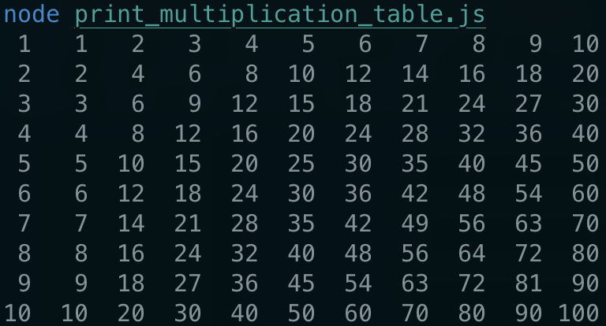

## Multiplication Table Pretty Printer 
## Description: 
This code acts as an exercise to print the multiplication table in a more aligned way in the console, with whitespace padding for each number.
## Usage:
if you have installed node, you can just run js.file with node in terminal, like: 
  

## Features to be added in the future:
1) may add interactive input, so that user can input the numbers to control the multiplication tables output
2) make the table visible in HTML instead of console.
